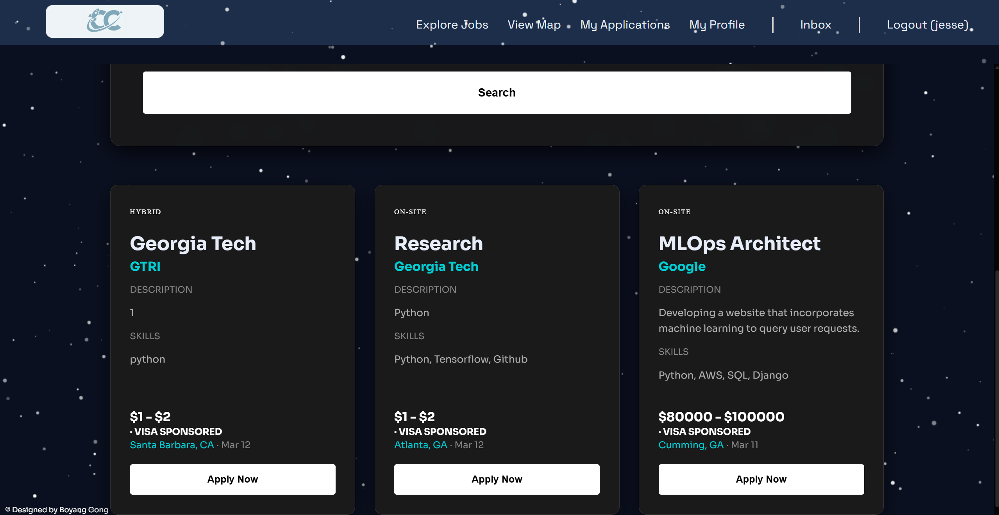

# CareerConnect

A full-stack job platform connecting job seekers with recruiters — built with Django.



---

## Features

**For Job Seekers**
- Build a profile with headline, skills, education, work experience, and links
- Search and filter jobs by title, skills, location, salary range, remote/on-site, and visa sponsorship
- Apply to jobs with one click and include a personalized note
- Track application status through a pipeline: Applied → Review → Interview → Offer → Closed
- Receive job recommendations based on your skills
- View job postings on an interactive map (Leaflet.js + OpenStreetMap), filter by distance, and set a preferred commute radius
- Control profile visibility with privacy settings

**For Recruiters**
- Post, edit, and manage job listings with office location pinned on a map
- Search candidates by skills, location, and projects
- Organize applicants through a Kanban pipeline
- Message candidates directly within the platform (in-app inbox with real-time polling)
- Email candidates through the platform to their personal email
- Save candidate searches and get notified of new matches
- Receive candidate recommendations for open postings
- View clusters of applicants by location on a map

**For Administrators**
- Manage users and roles to keep the platform fair and safe
- Moderate and remove job posts to prevent spam or abuse
- Export platform data as CSV for reporting and analysis

---

## Tech Stack

- **Backend:** Django 5
- **Frontend:** HTML, CSS (custom + Google Fonts)
- **Database:** SQLite (local)
- **Static files:** WhiteNoise
- **Maps:** Leaflet.js + OpenStreetMap
- **Messaging:** Django-native in-app inbox with AJAX long-polling

---

## Setup

1. Clone the repo and create a virtual environment:
   ```bash
   python -m venv venv
   source venv/bin/activate  # Windows: venv\Scripts\activate
   ```

2. Install dependencies:
   ```bash
   pip install django python-dotenv whitenoise
   ```

3. Create `careerconnect/.env`:
   ```
   DJANGO_SECRET_KEY=your-secret-key-here
   ```

4. Run migrations and start the server:
   ```bash
   cd careerconnect
   python manage.py migrate
   python manage.py runserver
   ```

---

## Team

Built by Team CareerConnect at Georgia Tech.