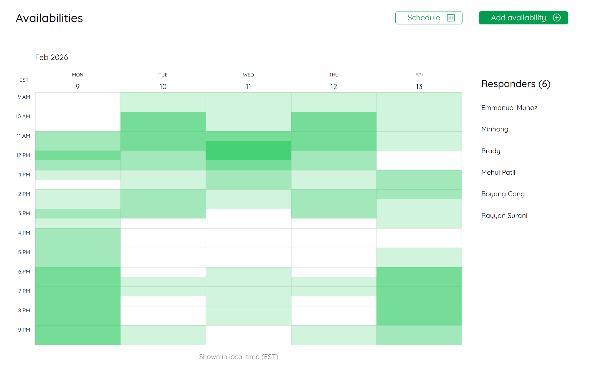
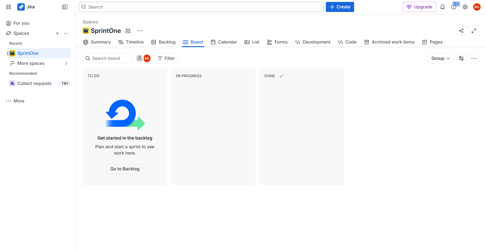

# CS 2340 Project 2

# Sprint 1 Planning

## Scrum Roles and Additional Responsibilities

### Scrum roles
- **Scrum Master:** Mehul  
- **Product Owner:** Minhong  
- **Developers:** All  

### Design / development / evaluation roles
- **All team members are full-stack developers** (front-end + back-end responsibilities shared across the team).

### Team availability
Screenshot of the shared weekly availability calendar:

---

## User Stories and Backlog (Sprint 1)

We plan to work on the **first 10 user stories** in sprint 1.

### Prioritized user stories
1. As a **Job Seeker**, I want to create a profile with my headline, skills, education, work experience, and links so recruiters can learn about me.
2. As a **Job Seeker**, I want to search for jobs with filters (title, skills, location, salary range, remote/on-site, visa sponsorship) so I can find opportunities that match my needs.
3. As a **Job Seeker**, I want to apply to a job with one click and include a tailored note so my application feels personalized.
4. As a **Job Seeker**, I want to track the status of my applications (Applied → Review → Interview → Offer → Closed) so I know where I stand.
5. As a **Job Seeker**, I want to set privacy options on my profile so I control what recruiters can see.
6. As a **Job Seeker**, I want to receive recommendations for jobs based on my skills so I discover opportunities I might have missed.
7. As a **Job Seeker**, I want to view job postings on an interactive map so I can see which ones are near me.
8. As a **Job Seeker**, I want to filter jobs on the map by distance from my current location so I can prioritize nearby opportunities.
9. As a **Job Seeker**, I want to set a preferred commute radius (e.g., 10 miles) on the map so I only see jobs within a reasonable travel distance.
10. As a **Recruiter**, I want to post and edit job roles so candidates can apply to my openings.

### Scrum board
Screenshot of the Scrum board (Jira):

[Our Scrum Board (Jira)](https://careerconnect.atlassian.net/jira/software/projects/CAR/boards/1)

---

## When to Meet the TA

- **First meeting:** During **class**
- **Second meeting:** Every **Thursday at 2:00 PM**  
  - Location: **CCB 267 (preferred)** or via **Teams**

---

## Staying in Touch

- We will use **Microsoft Teams** to communicate.
- We will address disagreements with coordination of the Scrum Master
- Our decision making process will be team-based, with input from all members.
- **Disallowed channels:** social media (e.g., Snapchat, Instagram, TikTok) and messaging services (e.g., WhatsApp, iMessage, GroupMe).

